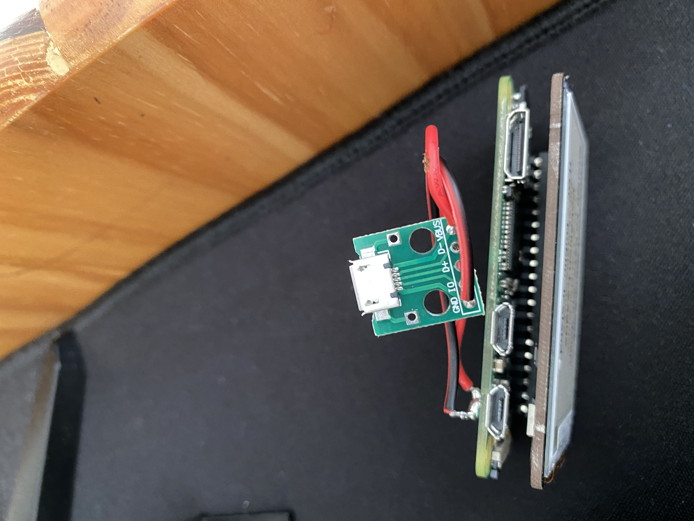
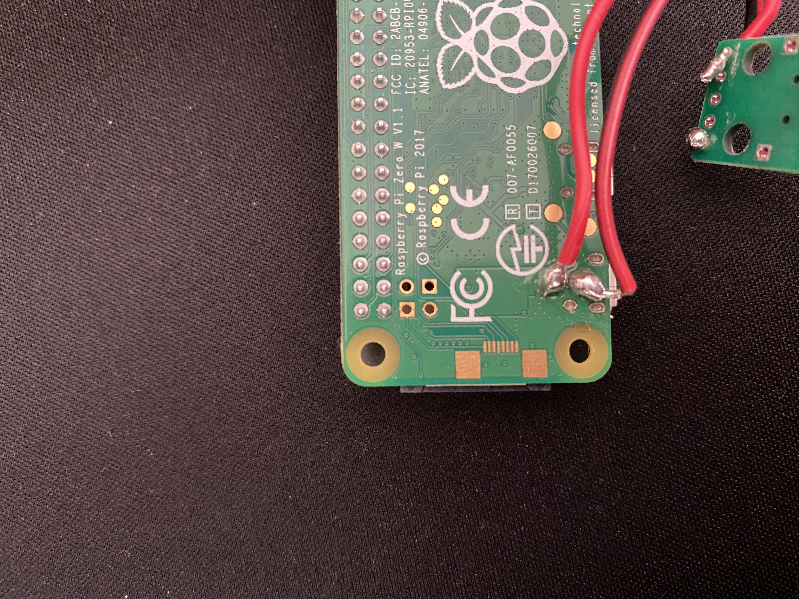
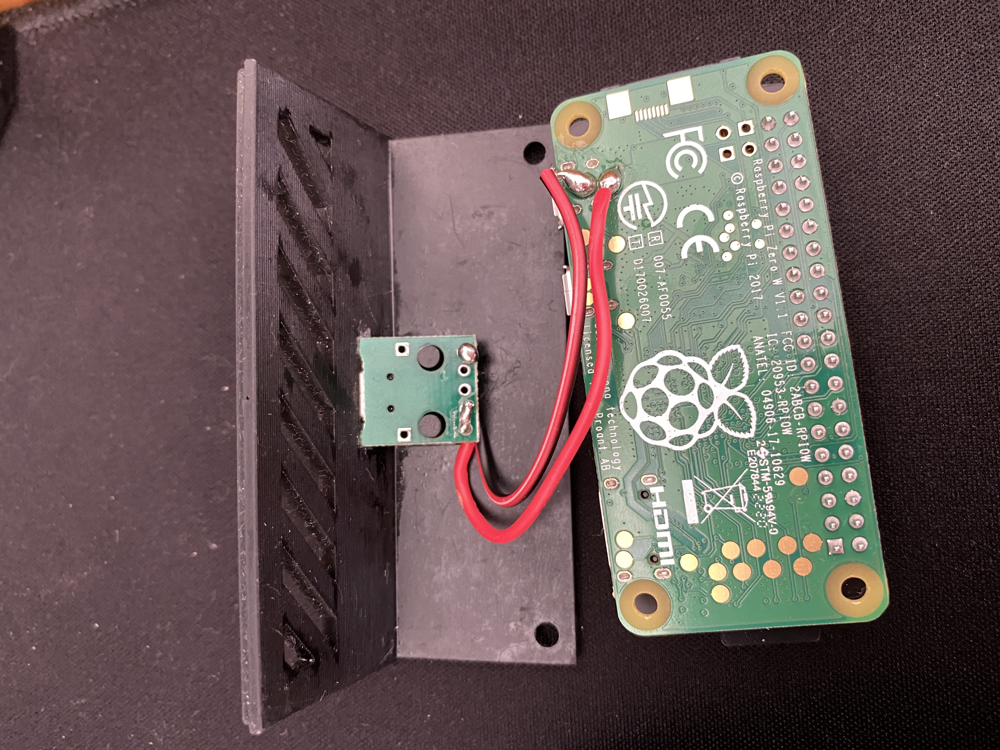
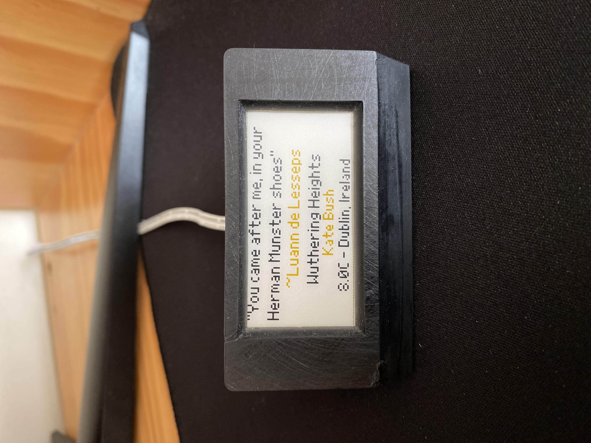
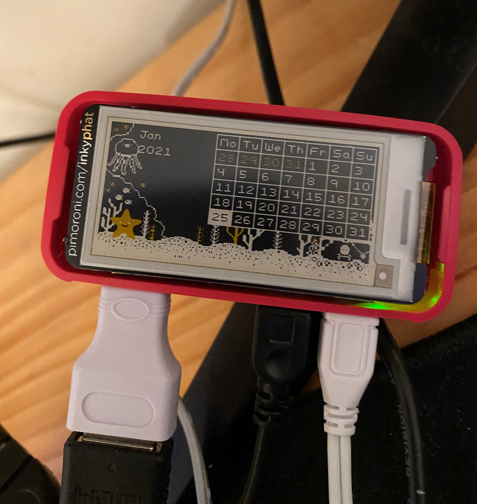
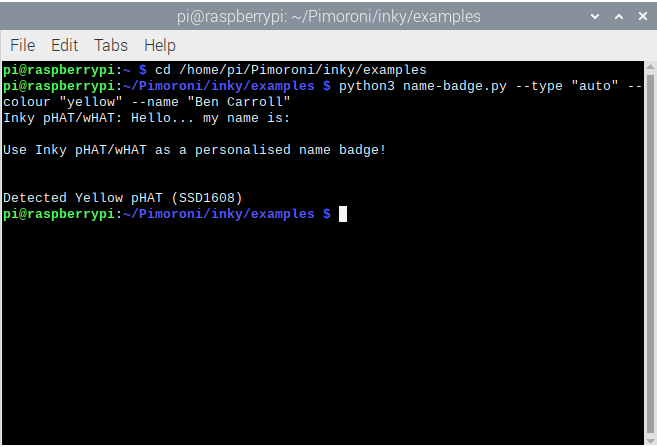
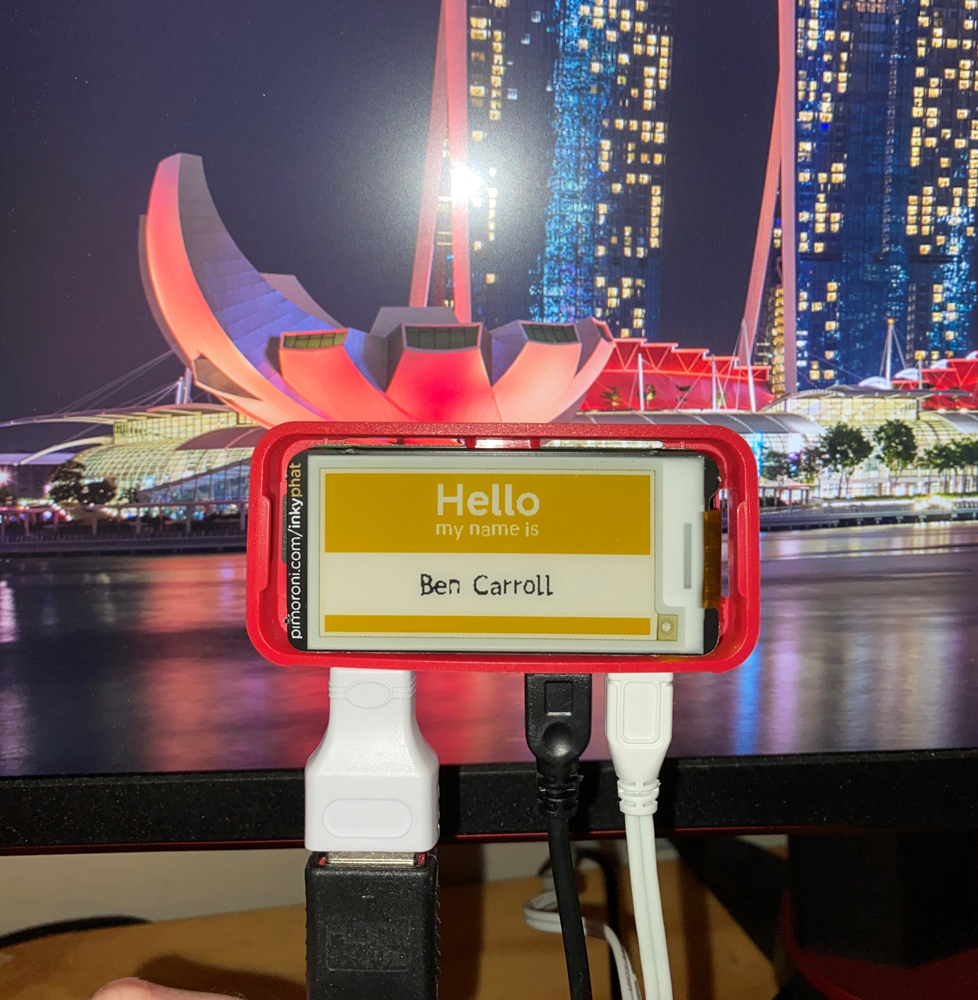
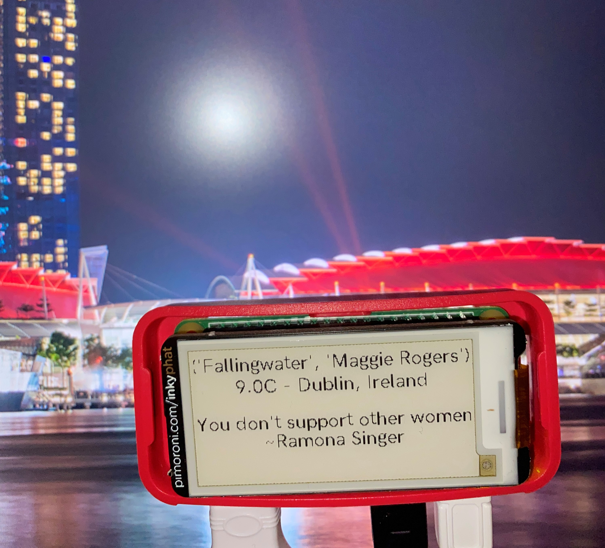
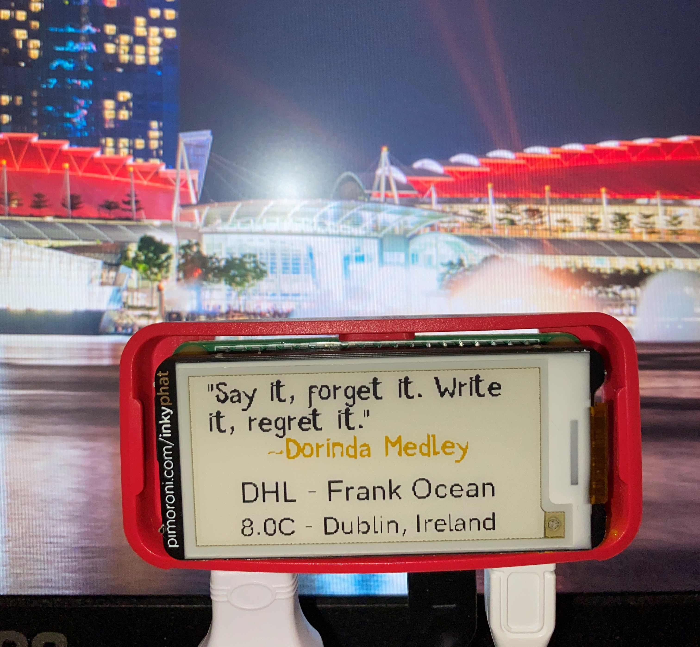
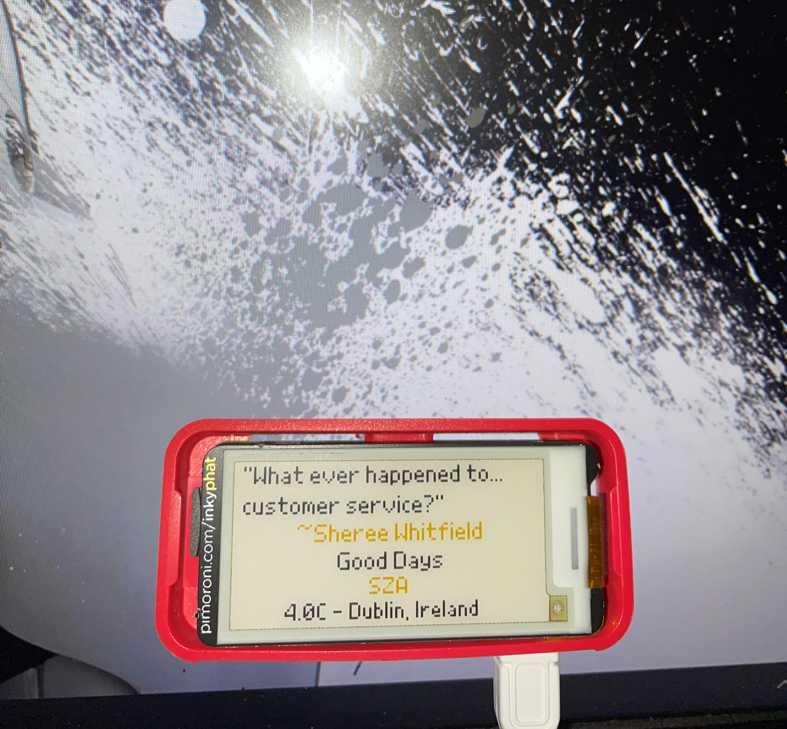

# Raspberry Pi Inky pHAT Peripheral Display - Quote, Currently Playing Spotify Song and Local Weather

## Overview
A project that uses a Raspberry Pi (Zero WH) to display information on to a Pimoroni Inky
pHAT screen display. The information displayed is data retrieved from API endpoints: a quote stored 
in a Firebase Realtime database, the song the user is currently listening to on Spotify, and
the weather in degrees celcius for the user's city. The Inky pHAT display will update periodically with
new information.

## Motivation
I started this project as a means to try out using Raspberry Pi for the first time. 
I was curious to see how the Pi's work, as well as how it functions with the Inky pHAT display
attached. To find out, I ended up creating this project that periodically makes a few HTTP GET requests to
various API's and displays the retrieved information out on the display, and as a result functions
as a peripheral display for a desk.

## Setup
1. Install Raspbian to Raspberry Pi and complete Pi setup.
2. Shut Pi down and attach Inky pHAT display. Power on Pi.
3. Install `inky` dependencies
    1. ```console
       curl https://get.pimoroni.com/inky | bash 
        ```
4. Try `name-badge.py` example to make sure every thing is working as intended.
    1. ```python
       python3 name-badge.py --type "auto" --colour "yellow" --name "Ben Carroll"
        ```
5. Clone this repo 
    1. ```console
       git clone https://github.com/bencarroll1/raspberryPiE-InkDisplay.git
        ```
6. Enter the following to `RaspberryPi.py`:
   1. WeatherAPI ([Request an API key](https://www.weatherapi.com/docs/)):
      1. API key 
    2. Spotify API ([Create an app on Spotify for Developers](https://developer.spotify.com/documentation/)):
       1. client_id
       2. client_secret
       3. redirect_uri
    3. Firebase ([Docs here](https://firebase.google.com/docs/reference/rest/database)):
        1. database name
        2. database region
7. In the file `ras.sh`, change the pathing to `raspberryPiE-InkDisplay` as appropriate.
   1. My own are listed below, but yours may be different:
    ```shell
   #!/usr/bin/bash
   cd /home/pi/Desktop/inkyTesting/raspberryPiE-InkDisplay
   python3 ./RaspberryPi.py 
   ```
   2. Save and place on the Desktop
8. Open a terminal and enter the following: 
    ```shell
   crontab -e 
   ```
   1. If its your first time using crontab, you will be prompted to select an editor. Choose Nano, the recommended one.
   2. Scroll to the bottom of the file, and under the last commented line enter:
    ```shell
   */3 9-23 * * * /home/pi/Desktop/ras.sh >> /home/pi/Desktop/cron.log 2>&1 
   ```
   3. Press `ctrl` + `o` to save the changes you have made
   4. Press `Enter`
   5. Press `ctrl` + `x` to exit Nano
    
This will run the bash script every 3 minutes between 9 a.m. and 11:59 p.m.

Some information on [burn in](https://forums.pimoroni.com/t/my-inky-phat-clock-refresh-speed-question/6955) from the Pimoroni Forums.

## 3D Printed Case & Soldering Process
In order to have this project neatly displayed on my desk as a peripheral display, I needed to have a neat way
to display the Inky pHAT display. To achieve this, I ordered a 3D-printed case from a local printer using 
[this](https://github.com/balenalabs/inkyshot/tree/master/assets/case-design1-rear-usb "Inkyshot 3D printed case") .stl design.

After I received the case, I got to work to attach a [new female micro USB adapter](https://dl.wish.com/b7LSt "Female micro USB adapter from Wish") to the Raspberry 
Pi for the power source connection as the current micro USB port was underneath the Pi and Inky pHAT,
making it difficult to both power and display the device neatly. Relocating the micro USB port would allow me to have
the power source wire come out the back of the case instead.

Using a soldering iron, I attached a short length of the red part of the [insulated wire](https://dl.wish.com/WrnQs "Insulated copper wire from Wish")
to the VBUS hole on the new female micro USB port and the black part of the wire to the ground (GND)
hole.



I then attached the other end of the red/VBUS wire to the circuit board connection furthest from the edge on the back
of where the original power source adapter is on the Pi (See picture below for reference), and the black/GND wire
to the circuit board connection nearest the edge.



With that, the soldering was complete and Pi was ready to be fitted into the case. There are two holes
on the back of the case that the new power source can sit in, and the Pi and Inky pHAt just fit into 
the front part of the case.



The finished Result:




## Results
To begin with, I set up the Rasberry Pi Zero with Raspbian, as this was the recommended OS.
Raspbian is probably not needed for this project, as the final product doesn't require a GUI, etc.,
but it was my first time using a Raspberry Pi, so I went with it. 

Once the Pi was set up, I shut it down and attached the Inky pHAT and rebooted it. 
I then installed the necessary dependencies and and tried displaying some of the example Python scripts
available for the Inky pHAT:







I then got to work on retrieving data from the specified APIs. This was straightforward as
I've retrieved data from APIs with Python before. 

Once I had that working, I began working on displaying the retrieved 
data on to the Inky pHAT. This was a bit trickier as I had to figure out how to 
display the data within the dimensions of the screen, and how to format it correctly.



Aftersome trial and error, I got the data displaying correctly within
the dimensions of the Inky pHAT. I also removed any brackets or unneeded characters from
the outputted display.



I then wrote a bash script to run the Python script and used Crontab to make run the bash script
every 3 minutes between 9 a.m. and 11:59 p.m. This isn't real time data, especially for Spotify but 3
minutes is roughly the length of a song, and I avoid burn in refreshing this infrequently.



The project in a 3D printed case:


Here is a short video showcasing the Pi Zero with the Inky pHAT screen in the 3D printed case in action: 

[https://photos.app.goo.gl/h4ub3YzUvfz5MzDr8](https://photos.app.goo.gl/h4ub3YzUvfz5MzDr8)
