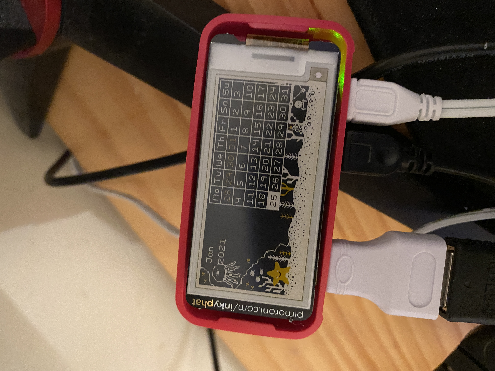
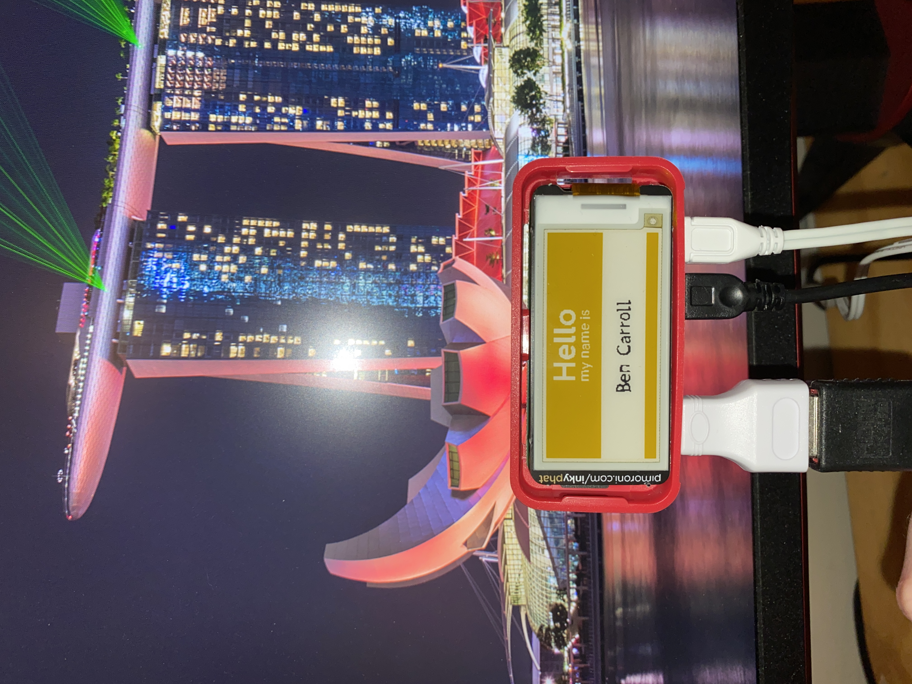
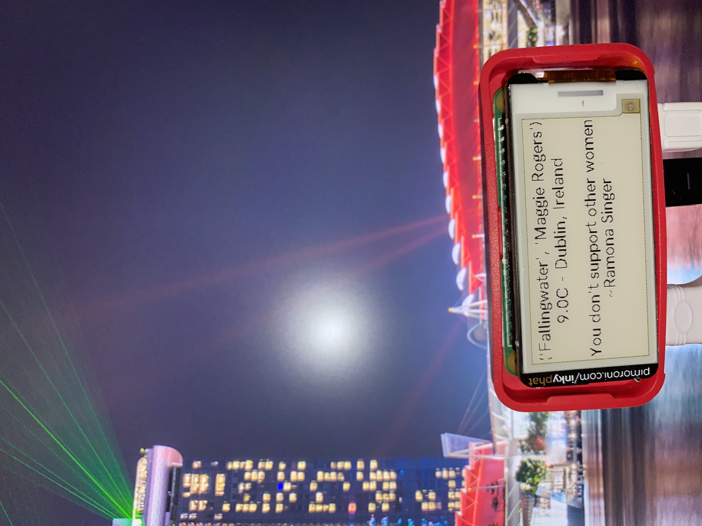
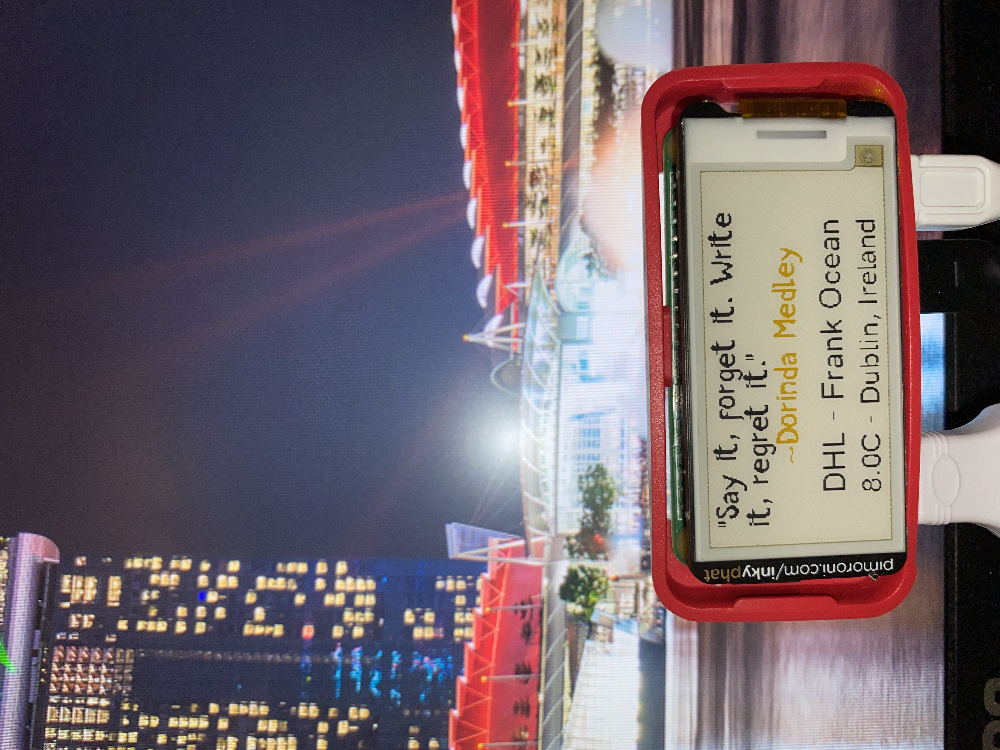

# Raspberry Pi Inky pHAT Peripheral Display - Quote, Currently Playing Spotify Song and Local Weather

## Overview
A project that uses a Raspberry Pi (Zero WH) to display information on to a Pimoroni Inky
pHAT screen display. The information displayed is data retrieved from API endpoints: a quote stored 
in a Firebase Realtime database, the song the users is currently listening to on Spotify, and
the weather in degrees celcius for the user's city. The Inky pHAT display will update periodically with
new information.

## Aims
This project aims to display a quote retrieved from an Firebase Realtime Database API endpoint. I set up the database as a means to store quotes, the name of the person who said it, and the city they're from.

The projects also aims to display the name of the song and corresponding artist the user is currently listening to on Spotify.

Finally, the project aims to display information about the weather in the user's city including the temperature in Celcius, a text-based description of the weather, and the city and country it corresponds to.


## Setup
1. Install Raspbian to Raspberry Pi and complete Pi setup.
2. Shut Pi down and attach Inky pHAT display. Power on Pi.
3. Install `inky` dependencies
    1. ```console
       curl https://get.pimoroni.com/inky | bash 
        ```
4. Try `name-badge.py` example to make sure every thing is working as intended.
    1. ```python
        python3 name-badge.py --type "auto" --colour "yellow" --name "Ben Carroll"
        ```
5. Clone this repo 
    1. ```console
       git clone https://github.com/bencarroll1/raspberryPiE-InkDisplay.git
        ```
6. Enter the following to `RaspberryPi.py`:
   1. WeatherAPI:
      1. API key 
    2. Spotify API:
       1. client_id
       2. client_secret
       3. redirect_uri
    3. Firebase
        1. database name
        2. database region
7. Run batch scipt?
8. Crontab -e on batch script to run as often as user wants?
    1. Command here
    2. Some information on [burn in](https://forums.pimoroni.com/t/my-inky-phat-clock-refresh-speed-question/6955) from the Pimoroni Forums.
9. 

## Motivation
I started this project as a means to try out using Raspberry Pi for the first time. 
I was curious to see how the Pi's work, as well as how it functions with the Inky pHAT display
attached. To find out, I ended up creating this project that periodically makes a few HTTP GET requests to
various API's and displays the retrieved information out on the display, and as a result functions
as a peripheral display for a desk.

## Results
To begin with, I set up the Rasberry Pi Zero with Raspbian, as this was the recommended OS.
Raspbian is probably not needed for this project, as the final product doesn't require a GUI, etc.,
but it was my first time using a Raspberry Pi, so I went with it. 

Once the Pi was set up, I shut it down and attached the Inky pHAT and rebooted it. 
I then installed the necessary dependencies and and tried displaying some of the example Python scripts
available for the Inky pHAT:





I then got to work on retrieving data from the specified APIs. This was straightforward as
I've retrieved data from APIs with Python before. 

Once I had that working, I began working on displaying the retrieved 
data on to the Inky pHAT. This was a bit trickier as I had to figure out how to 
display the data within the dimensions of the screen, and how to format it correctly.



Aftersome trial and error, I got the data displaying correctly within
the dimensions of the Inky pHAT. I also removed any brackets or unneeded characters from
the outputted display.



